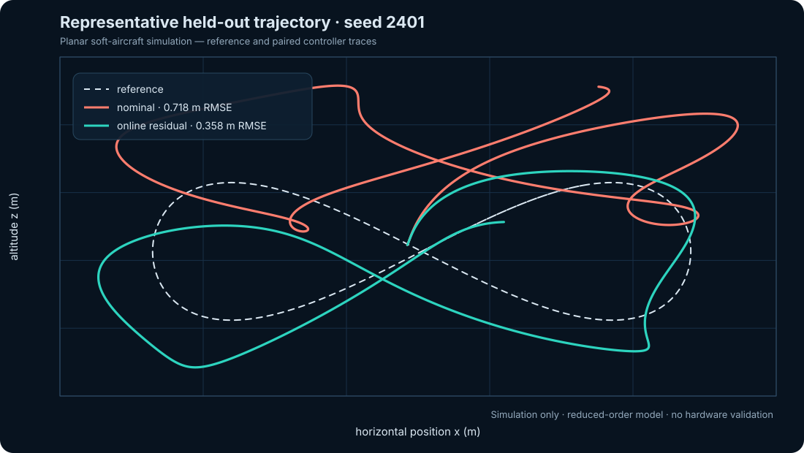

# SoftFlight Control Lab

A small, reproducible simulation benchmark for studying **online learned residual
compensation** on a planar deformable aerial robot. The demonstrator compares:

1. a nominal nonlinear trajectory-tracking controller; and
2. the same controller augmented by an online recursive least-squares (RLS)
   model of unmodeled translational acceleration.

The plant includes a compliant deformation mode, thrust-vector coupling,
quadratic drag, and deterministic gusts. Evaluation scenarios randomize mass,
inertia, stiffness, damping, coupling, drag, actuator effectiveness, and wind.
Everything runs with the Python standard library.



## Why this exists

This portfolio project demonstrates how I frame a learning-based control
problem: define a transparent nominal model, expose structured model mismatch,
adapt only the residual that the nominal controller cannot explain, and evaluate
on fixed held-out scenarios with paired metrics. It is intended as a compact
conversation starter for research at the intersection of learning, nonlinear
control, sim-to-real methodology, and soft aerial robotics.

## Quick start

Python 3.10 or newer is sufficient. From this project directory:

```bash
python scripts/run_benchmark.py
python -m unittest discover -s tests -v
```

The benchmark writes the following deterministic artifacts:

- `artifacts/benchmark_summary.json` — aggregate and paired metrics;
- `artifacts/episode_metrics.csv` — per-controller, per-scenario results;
- `artifacts/trajectory_comparison.svg` — reference and representative paths.

Useful options:

```bash
python scripts/run_benchmark.py --episodes 20 --seed 2401 --duration 12
python scripts/run_benchmark.py --help
```

The default evaluation seeds are derived from `2401`; they are held out from
the example development seeds documented in the model card. The two controllers
always see exactly the same scenario and initial state for a paired comparison.

### Reproduced default snapshot

The committed artifacts were generated with the no-argument command above:

| Controller | Position RMSE ↓ | Tail RMSE ↓ | Worst error ↓ | Successful scenarios |
|---|---:|---:|---:|---:|
| Nominal feedback | 0.605 m | 0.611 m | 0.864 m | 11/12 |
| Online residual | **0.264 m** | **0.200 m** | **0.585 m** | **12/12** |

Across the 12 paired scenarios, online residual compensation reduced mean
position RMSE by 53.34% and improved that metric in 12/12 cases. These values
describe this disclosed synthetic benchmark only; they are not physical-flight
performance claims. Exact per-scenario values and sampled parameters are in the
CSV artifact.

## System model

The state is

\[
s = [x, z, v_x, v_z, \theta, \omega, q, \dot q],
\]

where `q` is a lumped compliant shape coordinate. A thrust input and body torque
drive planar motion. Deformation changes the effective thrust direction and
feeds back into pitch dynamics. The compliant coordinate is excited by thrust,
angular rate, and gusts. This is a deliberately reduced-order model: it captures
coupled uncertainty without claiming fidelity to a particular platform.

The nominal controller computes a desired inertial acceleration, maps it to
thrust and desired attitude, and closes the attitude loop with PD feedback. The
adaptive controller additionally predicts the mismatch between measured and
nominal translational acceleration using bounded RLS. Its prediction is
subtracted from the next desired acceleration. The learner resets for every
episode; there is no hidden offline fit and no use of held-out plant parameters.

See [the model and evaluation card](docs/MODEL_CARD.md) for equations,
assumptions, parameter ranges, metrics, and appropriate interpretation.

## Repository layout

```text
softflight-control-lab/
├── artifacts/                 # Generated benchmark evidence
├── docs/MODEL_CARD.md         # Scope, evaluation, and limitations
├── scripts/run_benchmark.py   # Command-line entry point
├── src/softflight_control_lab/
│   ├── benchmark.py           # Paired held-out evaluation
│   ├── controllers.py         # Nominal and online-residual controllers
│   ├── dynamics.py            # Randomized soft-aircraft simulator
│   ├── reporting.py           # JSON, CSV, and dependency-free SVG
│   └── trajectory.py          # Smooth agile reference motion
└── tests/                     # Determinism, safety, and learning tests
```

## Evidence boundary

**This is a simulation-only portfolio demonstrator.** It is not a publication,
not a validated aerodynamic model, not flight-tested, and not evidence of work
with ROS, a physical robot, or a University of Bonn platform. Results establish
only that the implemented adaptive controller improves the selected metrics on
the disclosed synthetic benchmark. Hardware deployment would require system
identification, estimator design, actuator and latency models, safety filters,
real-time validation, and staged experiments.

## License

MIT — see [LICENSE](LICENSE).
